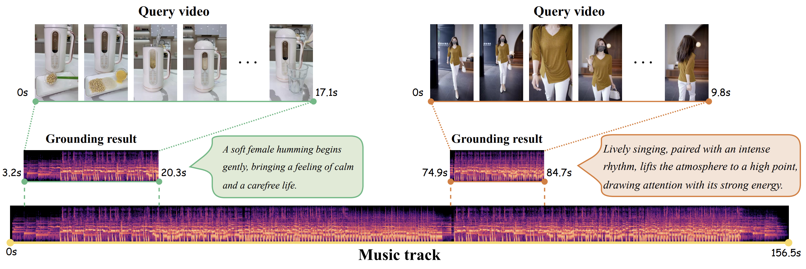

<div align="center">

<h1>Music Grounding by Short Video (ICCV 2025)</h1>

<div align="center">
  <a href="https://arxiv.org/abs/2408.16990"></a> &ensp;
  <a href="https://huggingface.co/datasets/xxayt/MGSV-EC"></a> &ensp;
  <a href="https://rucmm.github.io/MGSV/"></a> &ensp;
  <a href="https://github.com/xxayt/MGSV">
  </a> &ensp;
 &ensp;
</div>

<div>
    <a href='https://xxayt.github.io/' target='_blank'>Zijie Xin</a><sup>1</sup>&emsp;
    <a href='' target='_blank'>Minquan Wang</a><sup>2</sup>&emsp;
    <a href='https://scholar.google.com/citations?user=u7Dqok8AAAAJ
    ' target='_blank'>Jingyu Liu</a><sup>1</sup>&emsp;
    <a href='' target='_blank'>Ye Ma</a><sup>2</sup>&emsp;
    <a href='https://scholar.google.com/citations?user=jFQSmp8AAAAJ' target='_blank'>Quan Chen</a><sup>2</sup>&emsp;
    <a href='https://scholar.google.com/citations?user=9o5swhQAAAAJ' target='_blank'>Peng Jiang</a><sup>2</sup>&emsp;
    <a href='http://lixirong.net/' target='_blank'>Xirong Li</a><sup>1,📧</sup>&emsp;
</div>
<div>
    📧 Corresponding author
</div>
<div>
    <sup>1</sup> Renmin University of China&emsp; 
    <sup>2</sup> Kuaishou Technology&emsp;
</div>


</div>

<hr>


## 📄 Abstract
> *Adding proper background music helps complete a short video to be shared. Previous work tackles the task by video-to-music retrieval (V2MR), aiming to find the most suitable music track from a collection to match the content of a given query video. In practice, however, music tracks are typically much longer than the query video, necessitating (manual) trimming of the retrieved music to a shorter segment that matches the video duration. In order to bridge the gap between the practical need for music moment localization and V2MR, we propose a new task termed <u>M</u>usic <u>G</u>rounding by <u>S</u>hort <u>V</u>ideo (MGSV). To tackle the new task, we introduce a new benchmark, MGSV-EC, which comprises a diverse set of 53k short videos associated with 35k different music moments from 4k unique music tracks. Furthermore, we develop a new baseline method, MaDe, which performs both video-to-music **ma**tching and music moment **de**tection within a unified end-to-end deep network. Extensive experiments on MGSV-EC not only highlight the challenging nature of MGSV but also set MaDe as a strong baseline.*


## 👀 Introduction
This repository contains the official implementation of our paper, including training and evaluation scripts for the MGSV task.

## 🔧 Dependencies and Installation
We used Anaconda to setup a deep learning workspace that supports PyTorch. Run the following script to install all the required packages.

```shell
# git clone this repository
git clone https://github.com/xxayt/MGSV.git
cd MGSV

# create a new anaconda env
conda create -n MGSV_env python=3.8
conda activate MGSV_env

# install torch and dependencies
pip install -r requirements.txt
```
## 📦 Data

#### 📥 Data download

Please refer to the guides from [huggingface](https://huggingface.co/datasets/xxayt/MGSV-EC) for downloading the dataset MGSV-EC.

#### 📥 Encoder Download (Optional)

- AST Encoder: Download the AST model `audioset_0.4593.pth` from [Dropbox](https://www.dropbox.com/s/cv4knew8mvbrnvq/audioset_0.4593.pth?dl=1). This model follows the implementation in the [AST repo](https://github.com/YuanGongND/ast) and can be used for audio feature extraction. You can also explore the [](https://colab.research.google.com/github/YuanGongND/ast/blob/master/colab/AST_Inference_Demo.ipynb) for hands-on usage.

- CLIP Encoder: Download the CLIP model `ViT-B-32.pt` from [this link](https://openaipublic.azureedge.net/clip/models/40d365715913c9da98579312b702a82c18be219cc2a73407c4526f58eba950af/ViT-B-32.pt).
This model follows the implementation in the [CLIP repo](https://github.com/openai/CLIP), specifically [clip.py](https://github.com/openai/CLIP/blob/main/clip/clip.py#L36), for visual feature extraction.

#### 🗂️ Files organization

After downloading the dataset and encoder model, organize the files as follows:
```shell
.
├── dataset
│   └── MGSV-EC
│       ├── train_data.csv
│       ├── val_data.csv
│       └── test_data.csv
├── features
│   └── Kuai_feature
│       ├── ast_feature2p5/
│       └── vit_feature1/
├── model
│   ├── ...
│   └── pretrained_models
│       ├── audioset_0.4593.pth
│       └── ViT-B-32.pt
└── README.md
```


## 🚀 How to Run

#### Training

We provide a demo training script. To train MaDe on a specified GPU, use the following command:

```shell
bash scripts/train_kuai_all_feature.sh
```

Make sure to modify the data path, save path, and set the GPU for training. This process can be done using a single GPU.

#### Evaluation

To evaluate the model on the test set, use the following command:

```shell
bash scripts/test_kuai_all_feature.sh
```

Ensure that you update the script with the weight path `--load_uni_model_path` obtained from the training phase.


## 🤝 Acknowledgement
This implementation relies on resources from [AST](https://github.com/YuanGongND/ast), [DETR](https://github.com/facebookresearch/detr), [Moment-DETR](https://github.com/jayleicn/moment_detr), [CLIP4Clip](https://github.com/ArrowLuo/CLIP4Clip), [X-Pool](https://github.com/layer6ai-labs/xpool) and [UT-CMVMR](https://github.com/TencentARC-QQ/UT-CMVMR). We thank the original authors for their excellent contributions and for making their work publicly available.


## ✏️ Citation

If you find this work useful, please consider cite this paper:

```bibtex
@inproceedings{xin2025mgsv,
  title={Music Grounding by Short Video},
  author={Xin, Zijie and Wang, Minquan and Liu, Jingyu and Chen, Quan and Ma, Ye and Jiang, Peng and Li, Xirong},
  booktitle={Proceedings of the IEEE/CVF International Conference on Computer Vision},
  year={2025}
}
```


## 📜 License

The *MGSV-EC* dataset is under **[CC BY-NC-ND 4.0](https://creativecommons.org/licenses/by-nc-nd/4.0/)** license, see [DATA-LICENSE](./DATA-LICENSE). All the codes are under **[MIT](https://opensource.org/licenses/MIT)** license, see [LICENSE](./LICENSE). For commercial licensing or any use beyond research, please contact the authors.

#### 📥 Raw Vidoes/Music-tracks Access

The raw video and music files are not publicly available due to copyright and privacy constraints.  
Researchers interested in obtaining the full media content can contact **Kuaishou Technology** at: [wangminquan@kuaishou.com](mailto:wangminquan@kuaishou.com).

#### 📬 Contact for Issues

For any questions about this project (e.g., corrupted files or loading errors), please reach out at: [xinzijie@ruc.edu.cn](mailto:xinzijie@ruc.edu.cn)